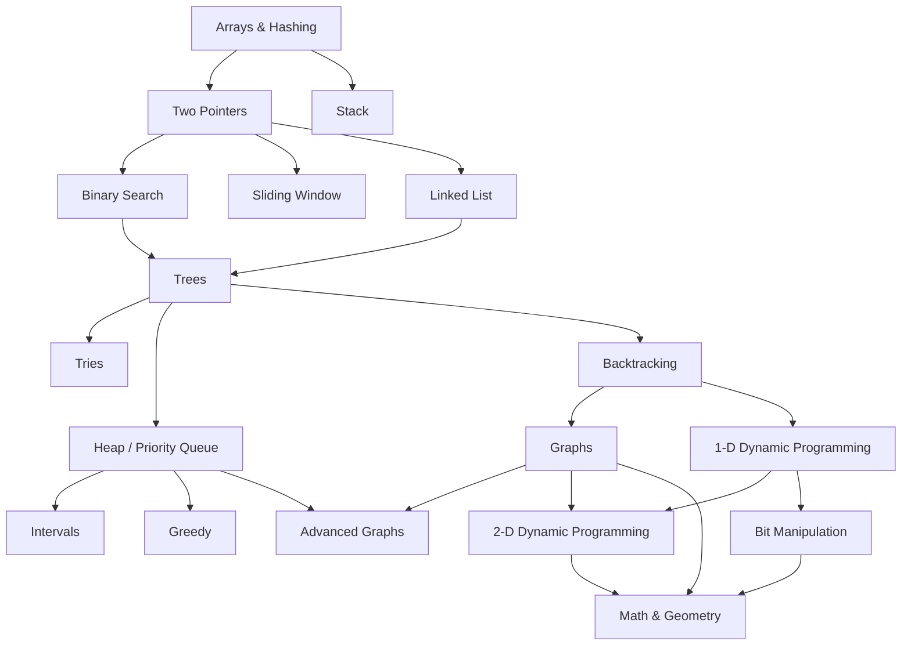

# NeetCode 150 Roadmap

A self-hosted copy of the [NeetCode roadmap](https://neetcode.io/roadmap): same 150 problems, same topic order, same prerequisite graph — but every link goes straight to LeetCode and to NeetCode's free YouTube videos, so no account on neetcode.io is needed.

**How to use**

- Work topics top to bottom (the numbered order below). Each topic's problems are listed easiest-first.
- When you solve a problem (`lc.py save` puts it in `problems/NNNN-slug.py`): tick its box and append `· [sol](problems/NNNN-slug.py)`.
- Progress: `grep -c '^- \[x\]' ROADMAP.md` (out of 150).
- Try each problem for ~30–45 min before opening the video.

## Prerequisite graph

## Order

1. [Arrays & Hashing](#1-arrays--hashing) (9)
2. [Two Pointers](#2-two-pointers) (5)
3. [Stack](#3-stack) (7)
4. [Binary Search](#4-binary-search) (7)
5. [Sliding Window](#5-sliding-window) (6)
6. [Linked List](#6-linked-list) (11)
7. [Trees](#7-trees) (15)
8. [Tries](#8-tries) (3)
9. [Heap / Priority Queue](#9-heap--priority-queue) (7)
10. [Backtracking](#10-backtracking) (9)
11. [Graphs](#11-graphs) (13)
12. [Advanced Graphs](#12-advanced-graphs) (6)
13. [1-D Dynamic Programming](#13-1-d-dynamic-programming) (12)
14. [2-D Dynamic Programming](#14-2-d-dynamic-programming) (11)
15. [Greedy](#15-greedy) (8)
16. [Intervals](#16-intervals) (6)
17. [Math & Geometry](#17-math--geometry) (8)
18. [Bit Manipulation](#18-bit-manipulation) (7)

---

## 1. Arrays & Hashing (9)

- [x] **217. Contains Duplicate** (Easy) · [LC](https://leetcode.com/problems/contains-duplicate/) · [Video](https://youtu.be/3OamzN90kPg) · [sol](problems/0217-contains-duplicate.py)
- [ ] **242. Valid Anagram** (Easy) · [LC](https://leetcode.com/problems/valid-anagram/) · [Video](https://youtu.be/9UtInBqnCgA)
- [x] **1. Two Sum** (Easy) · [LC](https://leetcode.com/problems/two-sum/) · [Video](https://youtu.be/KLlXCFG5TnA) · [sol](problems/0001-two-sum.py)
- [ ] **49. Group Anagrams** (Medium) · [LC](https://leetcode.com/problems/group-anagrams/) · [Video](https://youtu.be/vzdNOK2oB2E)
- [ ] **347. Top K Frequent Elements** (Medium) · [LC](https://leetcode.com/problems/top-k-frequent-elements/) · [Video](https://youtu.be/YPTqKIgVk-k)
- [ ] **238. Product of Array Except Self** (Medium) · [LC](https://leetcode.com/problems/product-of-array-except-self/) · [Video](https://youtu.be/bNvIQI2wAjk)
- [ ] **36. Valid Sudoku** (Medium) · [LC](https://leetcode.com/problems/valid-sudoku/) · [Video](https://youtu.be/TjFXEUCMqI8)
- [ ] **271. Encode and Decode Strings** (Medium) · [LC](https://leetcode.com/problems/encode-and-decode-strings/) · [Video](https://youtu.be/B1k_sxOSgv8)
- [ ] **128. Longest Consecutive Sequence** (Medium) · [LC](https://leetcode.com/problems/longest-consecutive-sequence/) · [Video](https://youtu.be/P6RZZMu_maU)

## 2. Two Pointers (5)

- [ ] **125. Valid Palindrome** (Easy) · [LC](https://leetcode.com/problems/valid-palindrome/) · [Video](https://youtu.be/jJXJ16kPFWg)
- [ ] **167. Two Sum II - Input Array Is Sorted** (Medium) · [LC](https://leetcode.com/problems/two-sum-ii-input-array-is-sorted/) · [Video](https://youtu.be/cQ1Oz4ckceM)
- [x] **15. 3Sum** (Medium) · [LC](https://leetcode.com/problems/3sum/) · [Video](https://youtu.be/jzZsG8n2R9A) · [sol](problems/0015-3sum.py)
- [ ] **11. Container With Most Water** (Medium) · [LC](https://leetcode.com/problems/container-with-most-water/) · [Video](https://youtu.be/UuiTKBwPgAo)
- [ ] **42. Trapping Rain Water** (Hard) · [LC](https://leetcode.com/problems/trapping-rain-water/) · [Video](https://youtu.be/ZI2z5pq0TqA)

## 3. Stack (7)

- [ ] **20. Valid Parentheses** (Easy) · [LC](https://leetcode.com/problems/valid-parentheses/) · [Video](https://youtu.be/WTzjTskDFMg)
- [ ] **155. Min Stack** (Medium) · [LC](https://leetcode.com/problems/min-stack/) · [Video](https://youtu.be/qkLl7nAwDPo)
- [ ] **150. Evaluate Reverse Polish Notation** (Medium) · [LC](https://leetcode.com/problems/evaluate-reverse-polish-notation/) · [Video](https://youtu.be/iu0082c4HDE)
- [x] **22. Generate Parentheses** (Medium) · [LC](https://leetcode.com/problems/generate-parentheses/) · [Video](https://youtu.be/s9fokUqJ76A) · [sol](problems/0022-generate-parentheses.py)
- [ ] **739. Daily Temperatures** (Medium) · [LC](https://leetcode.com/problems/daily-temperatures/) · [Video](https://youtu.be/cTBiBSnjO3c)
- [ ] **853. Car Fleet** (Medium) · [LC](https://leetcode.com/problems/car-fleet/) · [Video](https://youtu.be/Pr6T-3yB9RM)
- [ ] **84. Largest Rectangle in Histogram** (Hard) · [LC](https://leetcode.com/problems/largest-rectangle-in-histogram/) · [Video](https://youtu.be/zx5Sw9130L0)

## 4. Binary Search (7)

- [ ] **704. Binary Search** (Easy) · [LC](https://leetcode.com/problems/binary-search/) · [Video](https://youtu.be/s4DPM8ct1pI)
- [ ] **74. Search a 2D Matrix** (Medium) · [LC](https://leetcode.com/problems/search-a-2d-matrix/) · [Video](https://youtu.be/Ber2pi2C0j0)
- [ ] **875. Koko Eating Bananas** (Medium) · [LC](https://leetcode.com/problems/koko-eating-bananas/) · [Video](https://youtu.be/U2SozAs9RzA)
- [ ] **153. Find Minimum in Rotated Sorted Array** (Medium) · [LC](https://leetcode.com/problems/find-minimum-in-rotated-sorted-array/) · [Video](https://youtu.be/nIVW4P8b1VA)
- [ ] **33. Search in Rotated Sorted Array** (Medium) · [LC](https://leetcode.com/problems/search-in-rotated-sorted-array/) · [Video](https://youtu.be/U8XENwh8Oy8)
- [ ] **981. Time Based Key-Value Store** (Medium) · [LC](https://leetcode.com/problems/time-based-key-value-store/) · [Video](https://youtu.be/fu2cD_6E8Hw)
- [ ] **4. Median of Two Sorted Arrays** (Hard) · [LC](https://leetcode.com/problems/median-of-two-sorted-arrays/) · [Video](https://youtu.be/q6IEA26hvXc)

## 5. Sliding Window (6)

- [ ] **121. Best Time to Buy and Sell Stock** (Easy) · [LC](https://leetcode.com/problems/best-time-to-buy-and-sell-stock/) · [Video](https://youtu.be/1pkOgXD63yU)
- [ ] **3. Longest Substring Without Repeating Characters** (Medium) · [LC](https://leetcode.com/problems/longest-substring-without-repeating-characters/) · [Video](https://youtu.be/wiGpQwVHdE0)
- [ ] **424. Longest Repeating Character Replacement** (Medium) · [LC](https://leetcode.com/problems/longest-repeating-character-replacement/) · [Video](https://youtu.be/gqXU1UyA8pk)
- [ ] **567. Permutation in String** (Medium) · [LC](https://leetcode.com/problems/permutation-in-string/) · [Video](https://youtu.be/UbyhOgBN834)
- [ ] **76. Minimum Window Substring** (Hard) · [LC](https://leetcode.com/problems/minimum-window-substring/) · [Video](https://youtu.be/jSto0O4AJbM)
- [ ] **239. Sliding Window Maximum** (Hard) · [LC](https://leetcode.com/problems/sliding-window-maximum/) · [Video](https://youtu.be/DfljaUwZsOk)

## 6. Linked List (11)

- [ ] **206. Reverse Linked List** (Easy) · [LC](https://leetcode.com/problems/reverse-linked-list/) · [Video](https://youtu.be/G0_I-ZF0S38)
- [ ] **21. Merge Two Sorted Lists** (Easy) · [LC](https://leetcode.com/problems/merge-two-sorted-lists/) · [Video](https://youtu.be/XIdigk956u0)
- [ ] **143. Reorder List** (Medium) · [LC](https://leetcode.com/problems/reorder-list/) · [Video](https://youtu.be/S5bfdUTrKLM)
- [ ] **19. Remove Nth Node From End of List** (Medium) · [LC](https://leetcode.com/problems/remove-nth-node-from-end-of-list/) · [Video](https://youtu.be/XVuQxVej6y8)
- [ ] **138. Copy List with Random Pointer** (Medium) · [LC](https://leetcode.com/problems/copy-list-with-random-pointer/) · [Video](https://youtu.be/5Y2EiZST97Y)
- [ ] **2. Add Two Numbers** (Medium) · [LC](https://leetcode.com/problems/add-two-numbers/) · [Video](https://youtu.be/wgFPrzTjm7s)
- [ ] **141. Linked List Cycle** (Easy) · [LC](https://leetcode.com/problems/linked-list-cycle/) · [Video](https://youtu.be/gBTe7lFR3vc)
- [ ] **287. Find the Duplicate Number** (Medium) · [LC](https://leetcode.com/problems/find-the-duplicate-number/) · [Video](https://youtu.be/wjYnzkAhcNk)
- [ ] **146. LRU Cache** (Medium) · [LC](https://leetcode.com/problems/lru-cache/) · [Video](https://youtu.be/7ABFKPK2hD4)
- [ ] **23. Merge k Sorted Lists** (Hard) · [LC](https://leetcode.com/problems/merge-k-sorted-lists/) · [Video](https://youtu.be/q5a5OiGbT6Q)
- [ ] **25. Reverse Nodes in k-Group** (Hard) · [LC](https://leetcode.com/problems/reverse-nodes-in-k-group/) · [Video](https://youtu.be/1UOPsfP85V4)

## 7. Trees (15)

- [ ] **226. Invert Binary Tree** (Easy) · [LC](https://leetcode.com/problems/invert-binary-tree/) · [Video](https://youtu.be/OnSn2XEQ4MY)
- [ ] **104. Maximum Depth of Binary Tree** (Easy) · [LC](https://leetcode.com/problems/maximum-depth-of-binary-tree/) · [Video](https://youtu.be/hTM3phVI6YQ)
- [ ] **543. Diameter of Binary Tree** (Easy) · [LC](https://leetcode.com/problems/diameter-of-binary-tree/) · [Video](https://youtu.be/bkxqA8Rfv04)
- [ ] **110. Balanced Binary Tree** (Easy) · [LC](https://leetcode.com/problems/balanced-binary-tree/) · [Video](https://youtu.be/QfJsau0ItOY)
- [ ] **100. Same Tree** (Easy) · [LC](https://leetcode.com/problems/same-tree/) · [Video](https://youtu.be/vRbbcKXCxOw)
- [ ] **572. Subtree of Another Tree** (Easy) · [LC](https://leetcode.com/problems/subtree-of-another-tree/) · [Video](https://youtu.be/E36O5SWp-LE)
- [ ] **235. Lowest Common Ancestor of a Binary Search Tree** (Medium) · [LC](https://leetcode.com/problems/lowest-common-ancestor-of-a-binary-search-tree/) · [Video](https://youtu.be/gs2LMfuOR9k)
- [ ] **102. Binary Tree Level Order Traversal** (Medium) · [LC](https://leetcode.com/problems/binary-tree-level-order-traversal/) · [Video](https://youtu.be/6ZnyEApgFYg)
- [ ] **199. Binary Tree Right Side View** (Medium) · [LC](https://leetcode.com/problems/binary-tree-right-side-view/) · [Video](https://youtu.be/d4zLyf32e3I)
- [ ] **1448. Count Good Nodes in Binary Tree** (Medium) · [LC](https://leetcode.com/problems/count-good-nodes-in-binary-tree/) · [Video](https://youtu.be/7cp5imvDzl4)
- [ ] **98. Validate Binary Search Tree** (Medium) · [LC](https://leetcode.com/problems/validate-binary-search-tree/) · [Video](https://youtu.be/s6ATEkipzow)
- [ ] **230. Kth Smallest Element in a BST** (Medium) · [LC](https://leetcode.com/problems/kth-smallest-element-in-a-bst/) · [Video](https://youtu.be/5LUXSvjmGCw)
- [ ] **105. Construct Binary Tree from Preorder and Inorder Traversal** (Medium) · [LC](https://leetcode.com/problems/construct-binary-tree-from-preorder-and-inorder-traversal/) · [Video](https://youtu.be/ihj4IQGZ2zc)
- [ ] **124. Binary Tree Maximum Path Sum** (Hard) · [LC](https://leetcode.com/problems/binary-tree-maximum-path-sum/) · [Video](https://youtu.be/Hr5cWUld4vU)
- [ ] **297. Serialize and Deserialize Binary Tree** (Hard) · [LC](https://leetcode.com/problems/serialize-and-deserialize-binary-tree/) · [Video](https://youtu.be/u4JAi2JJhI8)

## 8. Tries (3)

- [ ] **208. Implement Trie (Prefix Tree)** (Medium) · [LC](https://leetcode.com/problems/implement-trie-prefix-tree/) · [Video](https://youtu.be/oobqoCJlHA0)
- [ ] **211. Design Add and Search Words Data Structure** (Medium) · [LC](https://leetcode.com/problems/design-add-and-search-words-data-structure/) · [Video](https://youtu.be/BTf05gs_8iU)
- [ ] **212. Word Search II** (Hard) · [LC](https://leetcode.com/problems/word-search-ii/) · [Video](https://youtu.be/asbcE9mZz_U)

## 9. Heap / Priority Queue (7)

- [ ] **703. Kth Largest Element in a Stream** (Easy) · [LC](https://leetcode.com/problems/kth-largest-element-in-a-stream/) · [Video](https://youtu.be/hOjcdrqMoQ8)
- [ ] **1046. Last Stone Weight** (Easy) · [LC](https://leetcode.com/problems/last-stone-weight/) · [Video](https://youtu.be/B-QCq79-Vfw)
- [ ] **973. K Closest Points to Origin** (Medium) · [LC](https://leetcode.com/problems/k-closest-points-to-origin/) · [Video](https://youtu.be/rI2EBUEMfTk)
- [ ] **215. Kth Largest Element in an Array** (Medium) · [LC](https://leetcode.com/problems/kth-largest-element-in-an-array/) · [Video](https://youtu.be/XEmy13g1Qxc)
- [ ] **621. Task Scheduler** (Medium) · [LC](https://leetcode.com/problems/task-scheduler/) · [Video](https://youtu.be/s8p8ukTyA2I)
- [ ] **355. Design Twitter** (Medium) · [LC](https://leetcode.com/problems/design-twitter/) · [Video](https://youtu.be/pNichitDD2E)
- [ ] **295. Find Median from Data Stream** (Hard) · [LC](https://leetcode.com/problems/find-median-from-data-stream/) · [Video](https://youtu.be/itmhHWaHupI)

## 10. Backtracking (9)

- [ ] **78. Subsets** (Medium) · [LC](https://leetcode.com/problems/subsets/) · [Video](https://youtu.be/REOH22Xwdkk)
- [ ] **39. Combination Sum** (Medium) · [LC](https://leetcode.com/problems/combination-sum/) · [Video](https://youtu.be/GBKI9VSKdGg)
- [ ] **46. Permutations** (Medium) · [LC](https://leetcode.com/problems/permutations/) · [Video](https://youtu.be/s7AvT7cGdSo)
- [ ] **90. Subsets II** (Medium) · [LC](https://leetcode.com/problems/subsets-ii/) · [Video](https://youtu.be/Vn2v6ajA7U0)
- [ ] **40. Combination Sum II** (Medium) · [LC](https://leetcode.com/problems/combination-sum-ii/) · [Video](https://youtu.be/rSA3t6BDDwg)
- [ ] **79. Word Search** (Medium) · [LC](https://leetcode.com/problems/word-search/) · [Video](https://youtu.be/pfiQ_PS1g8E)
- [ ] **131. Palindrome Partitioning** (Medium) · [LC](https://leetcode.com/problems/palindrome-partitioning/) · [Video](https://youtu.be/3jvWodd7ht0)
- [ ] **17. Letter Combinations of a Phone Number** (Medium) · [LC](https://leetcode.com/problems/letter-combinations-of-a-phone-number/) · [Video](https://youtu.be/0snEunUacZY)
- [ ] **51. N-Queens** (Hard) · [LC](https://leetcode.com/problems/n-queens/) · [Video](https://youtu.be/Ph95IHmRp5M)

## 11. Graphs (13)

- [ ] **200. Number of Islands** (Medium) · [LC](https://leetcode.com/problems/number-of-islands/) · [Video](https://youtu.be/pV2kpPD66nE)
- [ ] **133. Clone Graph** (Medium) · [LC](https://leetcode.com/problems/clone-graph/) · [Video](https://youtu.be/mQeF6bN8hMk)
- [ ] **695. Max Area of Island** (Medium) · [LC](https://leetcode.com/problems/max-area-of-island/) · [Video](https://youtu.be/iJGr1OtmH0c)
- [ ] **417. Pacific Atlantic Water Flow** (Medium) · [LC](https://leetcode.com/problems/pacific-atlantic-water-flow/) · [Video](https://youtu.be/s-VkcjHqkGI)
- [ ] **130. Surrounded Regions** (Medium) · [LC](https://leetcode.com/problems/surrounded-regions/) · [Video](https://youtu.be/9z2BunfoZ5Y)
- [ ] **994. Rotting Oranges** (Medium) · [LC](https://leetcode.com/problems/rotting-oranges/) · [Video](https://youtu.be/y704fEOx0s0)
- [ ] **286. Walls and Gates** (Medium) · [LC](https://leetcode.com/problems/walls-and-gates/) · [Video](https://youtu.be/e69C6xhiSQE)
- [ ] **207. Course Schedule** (Medium) · [LC](https://leetcode.com/problems/course-schedule/) · [Video](https://youtu.be/EgI5nU9etnU)
- [ ] **210. Course Schedule II** (Medium) · [LC](https://leetcode.com/problems/course-schedule-ii/) · [Video](https://youtu.be/Akt3glAwyfY)
- [ ] **684. Redundant Connection** (Medium) · [LC](https://leetcode.com/problems/redundant-connection/) · [Video](https://youtu.be/FXWRE67PLL0)
- [ ] **323. Number of Connected Components in an Undirected Graph** (Medium) · [LC](https://leetcode.com/problems/number-of-connected-components-in-an-undirected-graph/) · [Video](https://youtu.be/8f1XPm4WOUc)
- [ ] **261. Graph Valid Tree** (Medium) · [LC](https://leetcode.com/problems/graph-valid-tree/) · [Video](https://youtu.be/bXsUuownnoQ)
- [ ] **127. Word Ladder** (Hard) · [LC](https://leetcode.com/problems/word-ladder/) · [Video](https://youtu.be/h9iTnkgv05E)

## 12. Advanced Graphs (6)

- [ ] **332. Reconstruct Itinerary** (Hard) · [LC](https://leetcode.com/problems/reconstruct-itinerary/) · [Video](https://youtu.be/ZyB_gQ8vqGA)
- [ ] **1584. Min Cost to Connect All Points** (Medium) · [LC](https://leetcode.com/problems/min-cost-to-connect-all-points/) · [Video](https://youtu.be/f7JOBJIC-NA)
- [ ] **743. Network Delay Time** (Medium) · [LC](https://leetcode.com/problems/network-delay-time/) · [Video](https://youtu.be/EaphyqKU4PQ)
- [ ] **778. Swim in Rising Water** (Hard) · [LC](https://leetcode.com/problems/swim-in-rising-water/) · [Video](https://youtu.be/amvrKlMLuGY)
- [ ] **269. Alien Dictionary** (Hard) · [LC](https://leetcode.com/problems/alien-dictionary/) · [Video](https://youtu.be/6kTZYvNNyps)
- [ ] **787. Cheapest Flights Within K Stops** (Medium) · [LC](https://leetcode.com/problems/cheapest-flights-within-k-stops/) · [Video](https://youtu.be/5eIK3zUdYmE)

## 13. 1-D Dynamic Programming (12)

- [ ] **70. Climbing Stairs** (Easy) · [LC](https://leetcode.com/problems/climbing-stairs/) · [Video](https://youtu.be/Y0lT9Fck7qI)
- [ ] **746. Min Cost Climbing Stairs** (Easy) · [LC](https://leetcode.com/problems/min-cost-climbing-stairs/) · [Video](https://youtu.be/ktmzAZWkEZ0)
- [ ] **198. House Robber** (Medium) · [LC](https://leetcode.com/problems/house-robber/) · [Video](https://youtu.be/73r3KWiEvyk)
- [ ] **213. House Robber II** (Medium) · [LC](https://leetcode.com/problems/house-robber-ii/) · [Video](https://youtu.be/rWAJCfYYOvM)
- [ ] **5. Longest Palindromic Substring** (Medium) · [LC](https://leetcode.com/problems/longest-palindromic-substring/) · [Video](https://youtu.be/XYQecbcd6_c)
- [ ] **647. Palindromic Substrings** (Medium) · [LC](https://leetcode.com/problems/palindromic-substrings/) · [Video](https://youtu.be/4RACzI5-du8)
- [ ] **91. Decode Ways** (Medium) · [LC](https://leetcode.com/problems/decode-ways/) · [Video](https://youtu.be/6aEyTjOwlJU)
- [ ] **322. Coin Change** (Medium) · [LC](https://leetcode.com/problems/coin-change/) · [Video](https://youtu.be/H9bfqozjoqs)
- [ ] **152. Maximum Product Subarray** (Medium) · [LC](https://leetcode.com/problems/maximum-product-subarray/) · [Video](https://youtu.be/lXVy6YWFcRM)
- [ ] **139. Word Break** (Medium) · [LC](https://leetcode.com/problems/word-break/) · [Video](https://youtu.be/Sx9NNgInc3A)
- [ ] **300. Longest Increasing Subsequence** (Medium) · [LC](https://leetcode.com/problems/longest-increasing-subsequence/) · [Video](https://youtu.be/cjWnW0hdF1Y)
- [ ] **416. Partition Equal Subset Sum** (Medium) · [LC](https://leetcode.com/problems/partition-equal-subset-sum/) · [Video](https://youtu.be/IsvocB5BJhw)

## 14. 2-D Dynamic Programming (11)

- [ ] **62. Unique Paths** (Medium) · [LC](https://leetcode.com/problems/unique-paths/) · [Video](https://youtu.be/IlEsdxuD4lY)
- [ ] **1143. Longest Common Subsequence** (Medium) · [LC](https://leetcode.com/problems/longest-common-subsequence/) · [Video](https://youtu.be/Ua0GhsJSlWM)
- [ ] **309. Best Time to Buy and Sell Stock with Cooldown** (Medium) · [LC](https://leetcode.com/problems/best-time-to-buy-and-sell-stock-with-cooldown/) · [Video](https://youtu.be/I7j0F7AHpb8)
- [ ] **518. Coin Change II** (Medium) · [LC](https://leetcode.com/problems/coin-change-ii/) · [Video](https://youtu.be/Mjy4hd2xgrs)
- [ ] **494. Target Sum** (Medium) · [LC](https://leetcode.com/problems/target-sum/) · [Video](https://youtu.be/g0npyaQtAQM)
- [ ] **97. Interleaving String** (Medium) · [LC](https://leetcode.com/problems/interleaving-string/) · [Video](https://youtu.be/3Rw3p9LrgvE)
- [ ] **329. Longest Increasing Path in a Matrix** (Hard) · [LC](https://leetcode.com/problems/longest-increasing-path-in-a-matrix/) · [Video](https://youtu.be/wCc_nd-GiEc)
- [ ] **115. Distinct Subsequences** (Hard) · [LC](https://leetcode.com/problems/distinct-subsequences/) · [Video](https://youtu.be/-RDzMJ33nx8)
- [ ] **72. Edit Distance** (Medium) · [LC](https://leetcode.com/problems/edit-distance/) · [Video](https://youtu.be/XYi2-LPrwm4)
- [ ] **312. Burst Balloons** (Hard) · [LC](https://leetcode.com/problems/burst-balloons/) · [Video](https://youtu.be/VFskby7lUbw)
- [ ] **10. Regular Expression Matching** (Hard) · [LC](https://leetcode.com/problems/regular-expression-matching/) · [Video](https://youtu.be/HAA8mgxlov8)

## 15. Greedy (8)

- [ ] **53. Maximum Subarray** (Medium) · [LC](https://leetcode.com/problems/maximum-subarray/) · [Video](https://youtu.be/5WZl3MMT0Eg)
- [ ] **55. Jump Game** (Medium) · [LC](https://leetcode.com/problems/jump-game/) · [Video](https://youtu.be/Yan0cv2cLy8)
- [ ] **45. Jump Game II** (Medium) · [LC](https://leetcode.com/problems/jump-game-ii/) · [Video](https://youtu.be/dJ7sWiOoK7g)
- [ ] **134. Gas Station** (Medium) · [LC](https://leetcode.com/problems/gas-station/) · [Video](https://youtu.be/lJwbPZGo05A)
- [ ] **846. Hand of Straights** (Medium) · [LC](https://leetcode.com/problems/hand-of-straights/) · [Video](https://youtu.be/amnrMCVd2YI)
- [ ] **1899. Merge Triplets to Form Target Triplet** (Medium) · [LC](https://leetcode.com/problems/merge-triplets-to-form-target-triplet/) · [Video](https://youtu.be/kShkQLQZ9K4)
- [ ] **763. Partition Labels** (Medium) · [LC](https://leetcode.com/problems/partition-labels/) · [Video](https://youtu.be/B7m8UmZE-vw)
- [ ] **678. Valid Parenthesis String** (Medium) · [LC](https://leetcode.com/problems/valid-parenthesis-string/) · [Video](https://youtu.be/QhPdNS143Qg)

## 16. Intervals (6)

- [ ] **57. Insert Interval** (Medium) · [LC](https://leetcode.com/problems/insert-interval/) · [Video](https://youtu.be/A8NUOmlwOlM)
- [ ] **56. Merge Intervals** (Medium) · [LC](https://leetcode.com/problems/merge-intervals/) · [Video](https://youtu.be/44H3cEC2fFM)
- [ ] **435. Non-overlapping Intervals** (Medium) · [LC](https://leetcode.com/problems/non-overlapping-intervals/) · [Video](https://youtu.be/nONCGxWoUfM)
- [ ] **252. Meeting Rooms** (Easy) · [LC](https://leetcode.com/problems/meeting-rooms/) · [Video](https://youtu.be/PaJxqZVPhbg)
- [ ] **253. Meeting Rooms II** (Medium) · [LC](https://leetcode.com/problems/meeting-rooms-ii/) · [Video](https://youtu.be/FdzJmTCVyJU)
- [ ] **1851. Minimum Interval to Include Each Query** (Hard) · [LC](https://leetcode.com/problems/minimum-interval-to-include-each-query/) · [Video](https://youtu.be/5hQ5WWW5awQ)

## 17. Math & Geometry (8)

- [ ] **48. Rotate Image** (Medium) · [LC](https://leetcode.com/problems/rotate-image/) · [Video](https://youtu.be/fMSJSS7eO1w)
- [ ] **54. Spiral Matrix** (Medium) · [LC](https://leetcode.com/problems/spiral-matrix/) · [Video](https://youtu.be/BJnMZNwUk1M)
- [ ] **73. Set Matrix Zeroes** (Medium) · [LC](https://leetcode.com/problems/set-matrix-zeroes/) · [Video](https://youtu.be/T41rL0L3Pnw)
- [ ] **202. Happy Number** (Easy) · [LC](https://leetcode.com/problems/happy-number/) · [Video](https://youtu.be/ljz85bxOYJ0)
- [x] **66. Plus One** (Easy) · [LC](https://leetcode.com/problems/plus-one/) · [Video](https://youtu.be/jIaA8boiG1s) · [sol](problems/0066-plus-one.py)
- [ ] **50. Pow(x, n)** (Medium) · [LC](https://leetcode.com/problems/powx-n/) · [Video](https://youtu.be/g9YQyYi4IQQ)
- [ ] **43. Multiply Strings** (Medium) · [LC](https://leetcode.com/problems/multiply-strings/) · [Video](https://youtu.be/1vZswirL8Y8)
- [ ] **2013. Detect Squares** (Medium) · [LC](https://leetcode.com/problems/detect-squares/) · [Video](https://youtu.be/bahebearrDc)

## 18. Bit Manipulation (7)

- [x] **136. Single Number** (Easy) · [LC](https://leetcode.com/problems/single-number/) · [Video](https://youtu.be/qMPX1AOa83k) · [sol](problems/0136-single-number.py)
- [ ] **191. Number of 1 Bits** (Easy) · [LC](https://leetcode.com/problems/number-of-1-bits/) · [Video](https://youtu.be/5Km3utixwZs)
- [ ] **338. Counting Bits** (Easy) · [LC](https://leetcode.com/problems/counting-bits/) · [Video](https://youtu.be/RyBM56RIWrM)
- [ ] **190. Reverse Bits** (Easy) · [LC](https://leetcode.com/problems/reverse-bits/) · [Video](https://youtu.be/UcoN6UjAI64)
- [ ] **268. Missing Number** (Easy) · [LC](https://leetcode.com/problems/missing-number/) · [Video](https://youtu.be/WnPLSRLSANE)
- [ ] **371. Sum of Two Integers** (Medium) · [LC](https://leetcode.com/problems/sum-of-two-integers/) · [Video](https://youtu.be/gVUrDV4tZfY)
- [ ] **7. Reverse Integer** (Medium) · [LC](https://leetcode.com/problems/reverse-integer/) · [Video](https://youtu.be/HAgLH58IgJQ)
